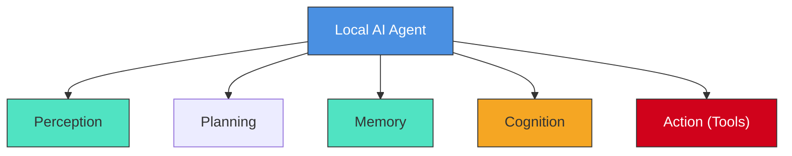

The term "agent" isn’t new to the world of technology. In fields like reinforcement learning, an agent refers to a software entity that interacts with its environment to achieve specific goals. Think of it as a digital explorer: it observes, thinks, and acts. But now, we’re entering a groundbreaking era where **Large Foundation Models (LFMs)**—think GPT-4, Llama, or Claude—are becoming the *brain* of these agents. This fusion transforms how AI agents reason, plan, and adapt.  

### Anatomy of an AI Agent  
A modern AI agent isn’t just code—it’s a dynamic system with three core components:  

1. **Perception**  
   The agent’s "senses." This could be as simple as reading text inputs (e.g., chat messages) or as complex as processing live video feeds, audio streams, or sensor data. Imagine a security agent "seeing" through cameras or a personal assistant "hearing" your voice commands.  

2. **Cognition**  
   The agent’s "mind." Powered by LFMs, this is where magic happens:  
   - **Reasoning**: Analyzing data to make decisions ("Should I adjust the thermostat?")  
   - **Planning**: Breaking goals into steps ("Complete Project X: Step 1, email the team; Step 2, draft outline...")  
   - **Memory**: Learning from past interactions to improve over time.  

3. **Action**  
   The agent’s "hands." Once a decision is made, it acts—whether sending an email, adjusting smart home devices, or flagging a security alert.  

### Why *Local* AI Agents Matter  
The word "local" isn’t just a buzzword—it’s a revolution. Unlike cloud-hosted AI (e.g., ChatGPT), local AI agents run entirely on **your hardware**. Here’s why this shift is transformative:  

- **Privacy First**: Your data stays on your device. No sensitive emails, health records, or security footage sent to third-party servers.  
- **Customization**: Tweak your agent’s personality, priorities, or skills. Want a sarcastic assistant? A hyper-efficient taskmaster? It’s your call.  
- **Cost Control**: Avoid subscription fees or per-API-call charges. Pay once, own forever.  
- **Independence**: No internet? No problem. Local agents work offline, ensuring reliability in any scenario.  

### The Road Ahead  
Building local AI agents isn’t without challenges. Running massive LFMs on consumer hardware requires optimization (think smaller, faster models). Memory management, real-time responsiveness, and energy efficiency are all puzzles to solve—but that’s what makes this journey exciting.  

This is just the beginning. As we refine these systems, local AI agents will evolve from experimental tools into indispensable partners—quietly managing our homes, safeguarding our data, and amplifying our productivity.  
